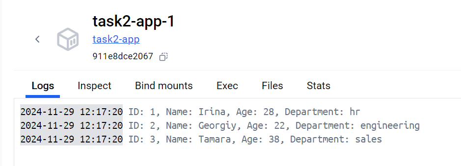

# Задание 2. Создание Docker-контейнера с PostgreSQL и Python-приложением

Цель: Научиться создавать Docker-контейнеры с базой данных PostgreSQL и Python-приложением для работы с ней. 
Использовать Docker Compose для координации нескольких контейнеров.

Описание задания:

    Создайте директорию для проекта и необходимые файлы.

    В файле app.py создайте скрипт, который будет выполнять следующие задачи:

    Подключение к базе данных PostgreSQL (обязательно только через psycopg2).

    Создание таблицы.

    Наполнение таблицы данными.

    Вывод данных из таблицы.

    В Dockerfile опишите шаги для создания Docker-образа Python-приложения, которое будет работать с PostgreSQL.

    Версия postgreSQL — 13.

    Создайте docker-compose.yml, чтобы оркестрировать контейнеры с PostgreSQL и Python-приложением.

    Теперь, когда все файлы готовы, можно запустить приложение с помощью Docker Compose.

    После выполнения команды docker-compose up Вы увидите в логах вывод от Python-приложения, который должен включать 
    данные из таблицы employees.

Названия столбцов — идентичные образцу. Значения — любые.

Результат задания — после выполнения задания у вас будет система, состоящая из двух контейнеров (PostgreSQL и 
Python-приложение), работающая с использованием Docker Compose. Python-приложение будет взаимодействовать с базой 
данных: создавать таблицы, добавлять записи и выводить данные. 

## Итоговая работа по курсу "Архитектор данных".

## Для развертывания базы Postgresql необходимо:
1. Скачать архив из репозитория;
2. Распаковать в нужную папку;
3. В терминале перейти в папку с базой данных и выполнить команду ***docker-compose up -d***.
4. Посмотреть результаты отработанного скрипта можно в логах сервиса app.

## Результат:
